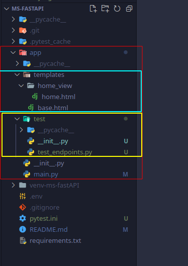

# Microservice to extract text from images

The goal of this project is to extract text from images using OCR (Optical Character Recognition). To get that we will use a third-library called `tesseract OCR`, but he main idea is use a machine learning algorith to extract data from images.

To deploy this ML app we will use docker.

## Dependencies - I

For this project we will use:

1. fastapi
2. gunicorn
3. uvicorn
4. jinja2

gunicorn and uvicorn can work together in production but not locally.

so we install all of it `pip install fastapi gunicorn uvicorn` and create a requirements.txt `pip freeze > requirements.txt`.

so our folder tree looks like that:

```
ms-fastapi
    |_app
        \
         |_ main.py
         |_ __init__.py
    |_ venv
    |_ .env
    |_ .gitignore
    |_ README.md
    |_ requirements

```

to run our server we use

```
uvicorn app.main:app --reload
```

## Dependencies - II

In fact we are not gonna build a REST-API since it not gonna response with a JSON but a HTML template made with `JINJA Templates`.
So to install it

`pip install jini2`

In this point we have to be aware that fastAPI has no idea about templates and HTML files because it is build to respond JSON data.

So to change that we need to import some features as `HTMLResponse`

if we implement an end-point with response_class=HTMLResponse it only must return a HTML if we try to response a JSON it will fall an error

Other important point is we need catch the resquest made to pass it as a attribute in function

```python
from fastapi import FastAPI, Request
from fastapi.responses import HTMLResponse
from fastapi.templating import Jinja2Templates
import os

# talling fastAPI where to find out a templtes

BASE_DIR = os.path.dirname(__file__) # /home/david/PROYECTOS/ms-fastapi/./app
templates = Jinja2Templates(directory=os.path.join(BASE_DIR,'templates'))

app = FastAPI()

@app.get('/', response_class=HTMLResponse)
def home_view(request:Request):
    return templates.TemplateResponse('home_view/home.html', {"request":request, "name":"david"})


# TemplateResponse need a context and it is the request itself
# besides it allow us to pass more data
```

Now we can create our templates

```
ms-fastapi
    |_app
        \
         |_ main.py
         |_ __init__.py
         |_ templates
            |_base.html
            |_home_view
                |_ home.html
    |_ venv
    |_ .env
    |_ .gitignore
    |_ README.md
    |_ requirements

```

base.html

```html
<!DOCTYPE html>
<html lang="en">
  <head>
    <!-- Required meta tags -->
    <meta charset="utf-8" />
    <meta name="viewport" content="width=device-width, initial-scale=1" />

    <!-- Bootstrap CSS -->
    <link
      href="https://cdn.jsdelivr.net/npm/bootstrap@5.1.3/dist/css/bootstrap.min.css"
      rel="stylesheet"
      integrity="sha384-1BmE4kWBq78iYhFldvKuhfTAU6auU8tT94WrHftjDbrCEXSU1oBoqyl2QvZ6jIW3"
      crossorigin="anonymous"
    />
    <style>
      body {
        background-color: grey;
      }
    </style>

    <title>Hello, world!</title>
  </head>
  <body class="bg-cfe text-light">
    
    <!--  -->
    

    <script
      src="https://cdn.jsdelivr.net/npm/bootstrap@5.1.3/dist/js/bootstrap.bundle.min.js"
      integrity="sha384-ka7Sk0Gln4gmtz2MlQnikT1wXgYsOg+OMhuP+IlRH9sENBO0LRn5q+8nbTov4+1p"
      crossorigin="anonymous"
    ></script>
  </body>
</html>
```

home.html, when it extends from base.html remember that start to look out from directory we specified at main.py

` templates = Jinja2Templates(directory=os.path.join(BASE_DIR,'templates'))`

```html

<!--  -->

<div class="text-center my-5 mx-5">
  <h1>hello {{name}}</h1>
</div>

```

## Dependencies - III

We gonna implement tester using `pytest` and `requests`

```
pip install pytest requests
```

to order to run all our test with pytest we must place a `pytest.ini` file at root directory with this content:

```
[pytest]
norecursedirs = lib/* bin/* include/*
```

then we must writte a test, remenber all function must start with `test_`

test_endpoints.py

```python
from fastapi.testclient import TestClient
from app.main import app

client = TestClient(app)

def test_get_home_view():
    response = client.get('/')
    assert response.status_code == 200
    assert 'text/html' in response.headers['content-type']

```



## Deploy to heroku using docker

As we are gonna use `tesseract-ocr` which is a software running on a Operating System so we need docker which create a image of OS where we could install whatever we nedd.

In order to get that we need create three files on our root directory

1. Dockerfile

```dockerfile
FROM python:3.8-slim

COPY ./app /app
COPY ./entrypoint.sh /entrypoint.sh
COPY ./requirements.txt /requirements.txt

RUN apt-get update && \
    apt-get install -y \
        build-essential \
        python3-dev \
        python3-setuptools \
        tesseract-ocr \
        make \
        gcc \
    && python3 -m pip install -r requirements.txt \
    && apt-get remove -y --purge make gcc build-essential \
    && apt-get autoremove -y \
    && rm -rf /var/lib/apt/lists/*

RUN chmod +x entrypoint.sh

CMD [ "./entrypoint.sh" ]
```

2. docker-compose.yml

```yml
version: "3.9"
services:
  web:
    build: .
    volumes:
      - ./app:/app
```

3. entrypoint.sh

```bash
#!/bin/bash

RUN_PORT=${PORT:-8000}

/usr/local/bin/gunicorn --worker-tmp-dir /dev/shm -k uvicorn.workers.UvicornWorker app.main:app --bind "0.0.0.0:${RUN_PORT}"
```

Once all this is done we can deploy it to heroku

1. we must create an app in heroku for instance myAppDocker
2. in our machine

```
heroku login
heroku container:login
```

deploy app

```
heroku container:push web --app myAppDocker
```

release our container

```
heroku container:release web --app myAppDocker
```

I can log into docker images placed in heroku

```
heroku run bash --app myAppDocker
```

## Two envirorment

From here we have two environment, develop and production.

So we need some way to distinguish both from each other. To do that we will create a `.env` file on the root directory where we place a `DEBUG=1`

In order to do that we will need:

1. `from pydantic import BaseSettings`
2. `from functools import lru_cache`
3. `from fastapi import Depends`

lru_cache is a decorator and tto work have to be installed `python-dotenv` bassically we make a class extended from `BaseSettings` and inside that we create a `class Config` which read de `.env` file

```python
from fastapi import FastAPI, Request, Depends
from fastapi.responses import HTMLResponse
from fastapi.templating import Jinja2Templates
import pathlib,os


from pydantic import BaseSettings

from functools import lru_cache

class Settings(BaseSettings):
    debug:bool= False
    class Config:
        env_file = 'app/.env'

# according to official doc this is the most efficient way to initialize these settings
# with this decorator we make sure this is gonna call one time
@lru_cache
def get_settings():
    return Settings()

# talling fastAPI where to find out a templtes

BASE_DIR = os.path.dirname(__file__)
templates = Jinja2Templates(directory=os.path.join(BASE_DIR,'templates'))

app = FastAPI()

@app.get('/', response_class=HTMLResponse)
def home_view(request: Request, settings:Settings = Depends(get_settings)):

    return templates.TemplateResponse('home_view/home.html', {"request":request, "name":"david"})


```

## Upload files

To upload files we need to install `pip install python-multipart` and import some dependencies as File UploadFile

```python
from fastapi import (
    Depends,
    File,
    UploadFile,
    HTTPException
    )
```

and to test it we will need `aiofiles`, `python-multipart` and `pillow`

```python

@app.post('/img-echo/', response_class=FileResponse)
async def img_echo_view(file:UploadFile=File(...),settings:Settings = Depends(get_settings)):

    if not settings.echo_active:
        raise HTTPException(detail="invalid endpoint", status_code=400)

    UPLOAD_DIR.mkdir(exist_ok=True)

    bytes_str = io.BytesIO(await file.read())

    try:
        img = Image.open(bytes_str) # converting bytes into a img if it could be all ok
    except:
        raise HTTPException(detail="invalid img", status_code=400)

    f_name = pathlib.Path(file.filename)
    file_extention = f_name.suffix
    dest = UPLOAD_DIR/f'{uuid.uuid1()}{file_extention}'
    img.save(dest)
    return dest
```

we return de path to de file uploaded.

If we wanna write a test for local environment:

```python
import os,time, shutil

def test_post_img_echo_view():
    img_saved_path = BASE_DIR/'img'

    for path in img_saved_path.glob('*'):

        try:
            img = Image.open(path)
        except:
            img = None

        response = client.post('/img-echo/',files={"file":open(path,'rb')})

        if img is None:
            assert response.status_code == 400
        else:
            assert response.status_code == 200
            r_stream = io.BytesIO(response.content)
            echo_img = Image.open(r_stream)
            # we are gonna compare both images original and uploaded, for that we need ImageChops
            difference = ImageChops.difference(echo_img,img).getbbox()
            assert difference is None # so is the same image


    shutil.rmtree(UPLOAD_DIR)
```

we dont wanna save in memory all the images uploaded so with the command `shutil.rmtree(UPLOAD_DIR)` allow us to delete it.

## Imlementing tesseract and pytesseract

Firt at all we will install tesserect on our local machite to test it.

```
sudo apt install tesseract-ocr
sudo apt install libtesseract-dev
```

and we need `pip install pytesseract`

Tesseract is a LSTM (long-short time memory) neural network so as a model of machine learning it makes predictions. To improve that predictions it must be trained.
